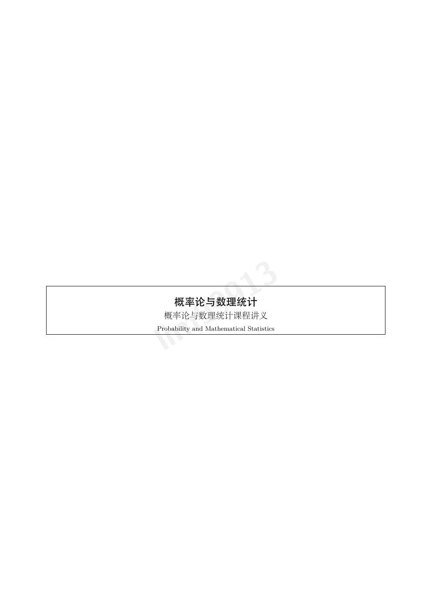

# 概率论与数理统计课程讲义

本仓库分享《概率论与数理统计》课程讲义的水印版 PDF。讲义由 **lim99913**
根据刘思齐老师的课堂讲授内容整理，并在手写笔记的基础上完成公式校订、图形重绘与
LaTeX 排版。

> 刘思齐老师的哔哩哔哩账号：**我真的不懂分析**  
> 课程链接：[https://www.bilibili.com/video/BV19LAUz7E4T](https://www.bilibili.com/video/BV19LAUz7E4T)

## 下载

- [概率论与数理统计电子笔记（最新版水印版 PDF）](./Notes/概率论与数理统计电子笔记-水印版.pdf)

当前版本共 **75 页**，更新时间为 **2026 年 8 月 2 日**。

## 内容

### 第一部分：概率论基础

- 第一章　随机事件与概率
- 第二章　随机变量及其分布

### 第二部分：多维分布与极限定理

- 第三章　多维随机变量及其分布
- 第四章　大数定律与中心极限定理

### 第三部分：数理统计

- 第五章　统计量及其分布
- 第六章　参数估计
- 第七章　假设检验

第七章特别梳理了 Fisher 与 Neyman–Pearson 两种假设检验观点，并包括正态总体参数
检验、似然比检验与 Pearson 卡方拟合优度检验等内容。

## 编写说明

- 讲义参考《概率论与数理统计教程》的课程脉络重新编排。
- 尽可能保留课堂中的推导过程、直觉、疑问与思考路径。
- 正文中标有“◆”的内容为参考书中的补充条目，仅作简要介绍。
- 讲义在 Codex 的协助下完成课堂内容转写、公式校订、图形重绘与 LaTeX 排版。

## 勘误与交流

限于作者的知识水平，讲义中难免存在疏漏与错误。欢迎通过
[Issues](../../issues) 提交勘误与建议。

## 使用说明

本仓库仅供个人学习与非商业交流。转载或分享时请保留作者署名、来源说明与原有水印；
不得移除水印、冒用署名、篡改后重新发布或用于商业用途。详细条款见 [LICENSE](./LICENSE)。

